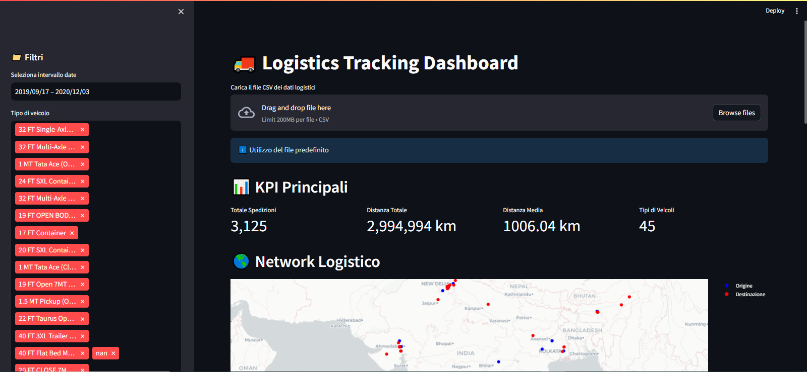

# 🚚 Logistics Tracking Dashboard

Una dashboard interattiva per il monitoraggio e l'analisi dei dati logistici, disponibile in tre versioni con funzionalità crescenti per adattarsi alle diverse esigenze di analisi.



## 🎯 Versioni Disponibili

### 1. Basic Version (`logistic_dashboard_basic.py`)
- **Funzionalità Base**:
  - Caricamento dati CSV
  - Filtri essenziali (data e tipo veicolo)
  - KPI fondamentali:
    - Totale prenotazioni
    - Distanza totale
    - Distanza media
  - Visualizzazioni semplici:
    - Top 10 materiali
    - Trend temporale base
    - Tabella dati (prime 100 righe)

### 2. Standard Version (`logistic_dashboard_standard.py`)
- **Tutte le funzionalità Basic più**:
  - Filtri avanzati per materiali
  - Mappa logistica base
  - KPI estesi
  - Analisi dei materiali approfondita:
    - Statistiche dettagliate
    - Visualizzazioni interattive
  - Trend analysis migliorata
  - Tabella dati completa

### 3. Premium Version (`logistic_dashboard_premium.py`)
- **Tutte le funzionalità Standard più**:
  - Machine Learning per previsioni
  - Mappa logistica avanzata con rotte
  - Analisi performance approfondita
  - Feature importance analysis
  - Metriche predittive
  - Dashboard multi-tab

## 🛠️ Requisiti di Sistema

### Python e Ambiente
- Python 3.8 o superiore
- Ambiente virtuale (consigliato)

### Dipendenze Specifiche
```
streamlit==1.29.0
pandas==2.1.4
plotly==5.18.0
numpy==1.26.2
openpyxl==3.1.2
python-dateutil==2.8.2
pytz==2023.3.post1
scikit-learn==1.3.2
statsmodels==0.14.1
python-dotenv==1.0.1
```

## 📁 Struttura del Progetto
```
logistic-data-dash/
├── logistic_dashboard_basic.py      # Versione base
├── logistic_dashboard_standard.py   # Versione standard
├── logistic_dashboard_premium.py    # Versione premium
├── requirements.txt                 # Dipendenze
├── README.md                        # Documentazione
├── .gitignore                       # File ignorati
├── LICENSE                          # Licenza MIT
└── sample_data/                     # Dati di esempio
```

## 🚀 Installazione

1. **Clona il Repository**
```bash
git clone [url-repository]
cd logistic-data-dash
```

2. **Crea Ambiente Virtuale**
```bash
python -m venv venv
source venv/bin/activate  # Linux/Mac
venv\Scripts\activate     # Windows
```

3. **Installa Dipendenze**
```bash
pip install -r requirements.txt
```

## 💻 Avvio dell'Applicazione

Scegli la versione da avviare in base alle tue necessità:

### Versione Basic
```bash
streamlit run logistic_dashboard_basic.py
```

### Versione Standard
```bash
streamlit run logistic_dashboard_standard.py
```

### Versione Premium
```bash
streamlit run logistic_dashboard_premium.py
```

## 📊 Formato Dati Richiesto

Il file CSV deve contenere le seguenti colonne:
- `BookingID`: Identificativo unico della prenotazione
- `BookingID_Date`: Data e ora della prenotazione
- `Origin_Location`: Località di partenza
- `Destination_Location`: Località di destinazione
- `vehicleType`: Tipo di veicolo utilizzato
- `Material Shipped`: Materiale trasportato
- `TRANSPORTATION_DISTANCE_IN_KM`: Distanza in kilometri
- `Org_lat_lon`: Coordinate di origine (richiesto per Standard e Premium)
- `Des_lat_lon`: Coordinate di destinazione (richiesto per Standard e Premium)

## 🔍 Funzionalità Dettagliate

### Visualizzazioni
- Mappe interattive delle rotte
- Grafici temporali
- Analisi dei materiali
- Statistiche veicoli

### Analisi
- KPI logistici
- Trend temporali
- Performance analysis
- Previsioni (Premium)

### Filtri
- Intervallo date
- Tipo veicolo
- Materiali
- Località

## 🔄 Aggiornamenti e Manutenzione

Per aggiornare all'ultima versione:
```bash
git pull origin main
pip install -r requirements.txt
```

## 📄 Licenza
Questo progetto è rilasciato sotto licenza MIT. Vedi il file `LICENSE` per i dettagli.

## 🤝 Contributi
I contributi sono benvenuti! Per contribuire:
1. Fai il fork del repository
2. Crea un branch per le tue modifiche
3. Invia una pull request

## 🆘 Supporto

### Problemi Comuni
1. **Errori nel caricamento dati**: Verifica il formato del CSV
2. **Errori nelle date**: Usa il formato corretto (YYYY-MM-DD HH:MM:SS)
3. **Problemi di dipendenze**: Verifica requirements.txt

### Come Ottenere Aiuto
- Apri una Issue su GitHub
- Controlla la documentazione
- Verifica i requisiti di sistema

## 📝 Note di Sviluppo
- Sviluppato con Python 3.8+
- Interfaccia costruita con Streamlit
- Visualizzazioni con Plotly
- Machine Learning con Scikit-learn